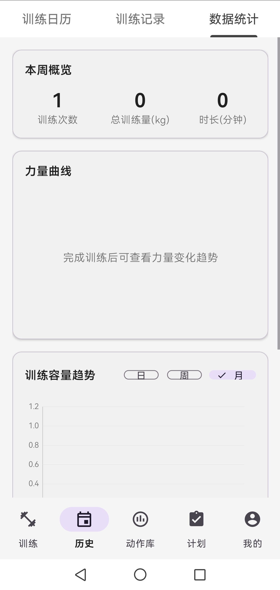
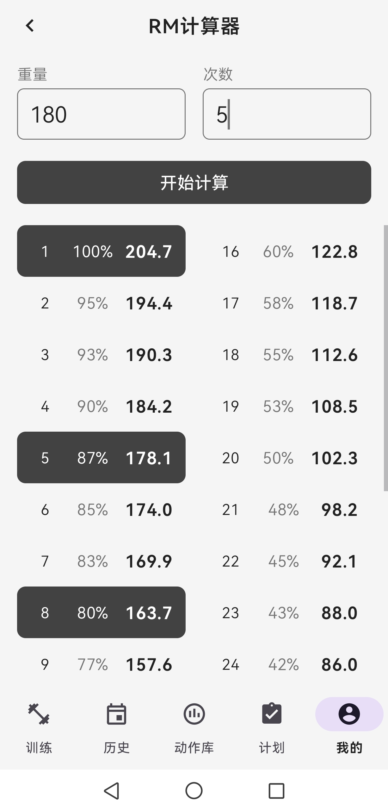
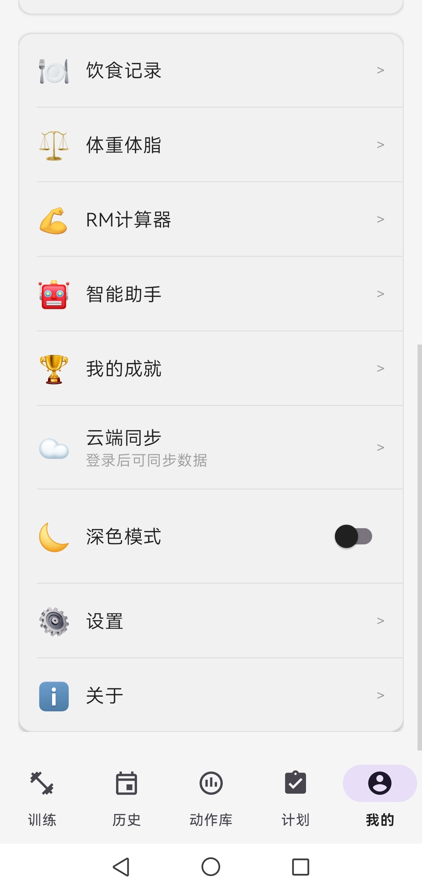
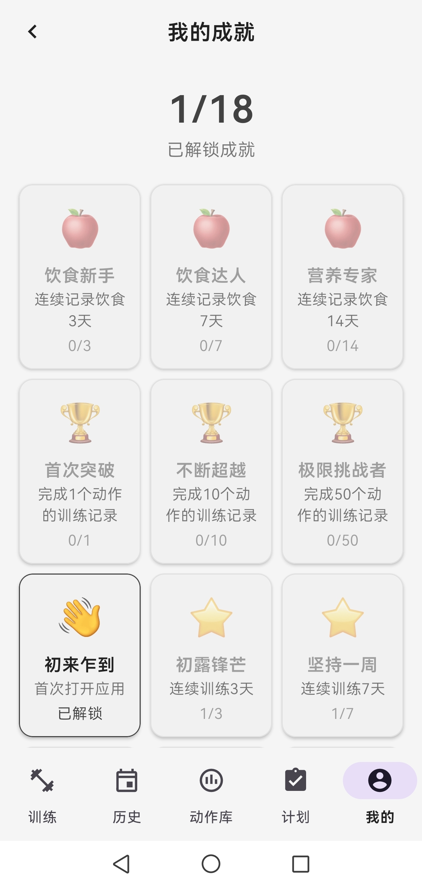
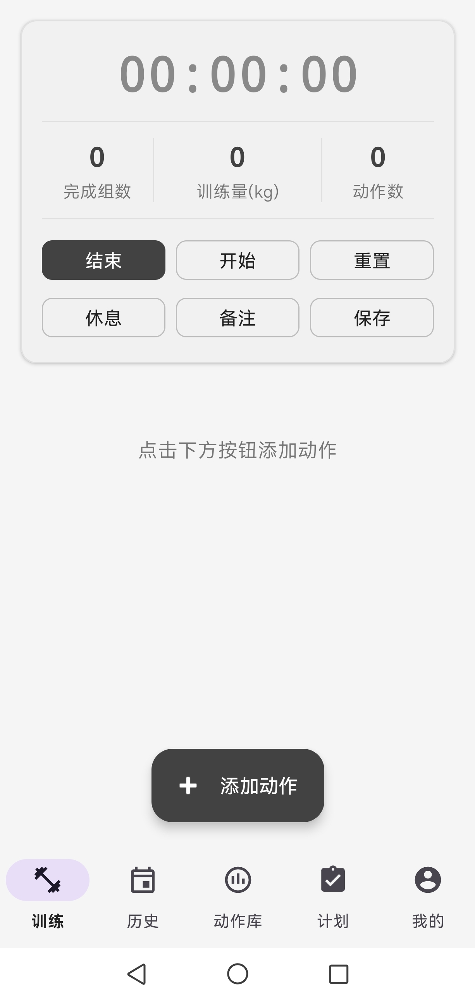
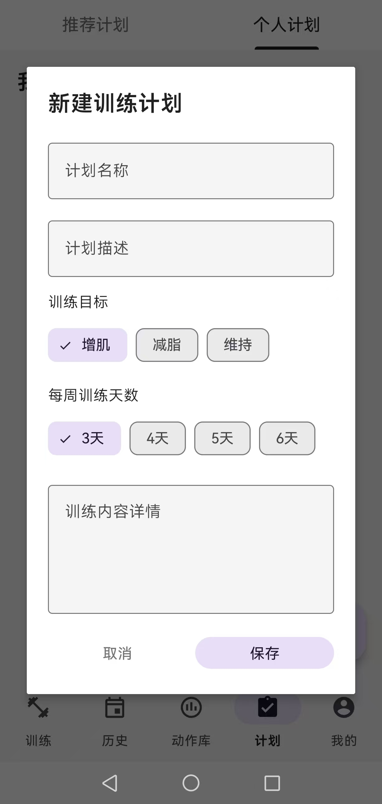
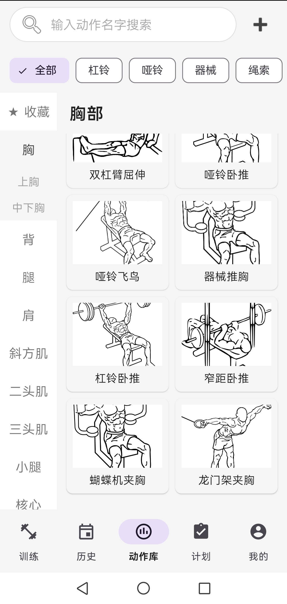

# 健录 - 专业健身训练记录应用

[](https://www.android.com/)
[](https://kotlinlang.org/)
[](https://spring.io/projects/spring-boot)

健录是一款为认真对待健身的训练者打造的专业记录工具。它提供完整的训练日志系统，支持详细记录每个动作的组数、重量、次数和超级组训练，内置95个动作库覆盖全身肌群；配备科学的饮食管理功能，拥有200+食物数据库可自动计算营养成分和每日热量摄入；通过可视化图表展示训练趋势、肌肉群分析和个人记录突破，帮助你追踪体重、体脂率等身体数据变化。

## 应用截图

<p align="center">
  
</p>

<p align="center">
  
  
  
  
</p>

<p align="center">
  
  
  
</p>

## 功能特性

### 训练记录
- 详细记录每次训练的动作、组数、重量、次数
- 支持超级组训练记录
- 自动计算训练量和训练时长
- 训练模板功能，快速开始常用训练

### 数据统计
- 可视化图表展示训练趋势
- 肌肉群训练分析
- 个人记录（PR）追踪
- 1RM计算器

### 饮食管理
- 200+食物数据库
- 营养成分自动计算
- 每日热量和营养素追踪
- 自定义食物添加

### 身体数据
- 体重、体脂率、围度等多维度记录
- 身体数据变化曲线
- 目标设定和进度追踪

### 动作库
- 95个训练动作，涵盖各大肌群
- 按肌肉群分类查找
- 收藏常用动作

### 训练日历
- 日历视图查看训练历史
- 训练频率统计
- 休息日提醒

## 技术栈

### Android客户端
- **语言**: Kotlin
- **架构**: MVVM
- **数据库**: Room
- **网络**: Retrofit + OkHttp
- **异步**: Coroutines
- **图表**: MPAndroidChart
- **图片加载**: Glide
- **依赖注入**: 手动依赖注入

### 后端服务器
- **框架**: Spring Boot 3.2.0
- **数据库**: MySQL
- **ORM**: MyBatis-Plus
- **认证**: JWT
- **安全**: Spring Security

## 项目结构

```
.
├── app/                          # Android应用
│   ├── src/main/
│   │   ├── java/com/fitness/training/
│   │   │   ├── data/            # 数据层
│   │   │   │   ├── entity/      # 实体类
│   │   │   │   ├── dao/         # 数据访问对象
│   │   │   │   └── database/    # 数据库配置
│   │   │   ├── network/         # 网络层
│   │   │   ├── ui/              # UI层
│   │   │   ├── util/            # 工具类
│   │   │   ├── ai/              # AI助手
│   │   │   └── config/          # 配置
│   │   └── res/                 # 资源文件
│   └── build.gradle.kts
├── fitness-server/              # Spring Boot后端
│   ├── src/main/
│   │   ├── java/com/fitness/server/
│   │   │   ├── controller/      # 控制器
│   │   │   ├── service/         # 业务逻辑
│   │   │   ├── entity/          # 实体类
│   │   │   ├── mapper/          # MyBatis映射
│   │   │   └── util/            # 工具类
│   │   └── resources/
│   │       ├── application.yml  # 配置文件（需自行创建）
│   │       └── schema.sql       # 数据库脚本
│   └── pom.xml
└── README.md
```

## 快速开始

### Android客户端

#### 环境要求
- Android Studio Arctic Fox或更高版本
- JDK 17
- Android SDK 24+（最低支持Android 7.0）

#### 构建步骤
1. 克隆项目
```bash
git clone https://github.com/wua520/fitness-app.git
cd fitness-app
```

2. 打开Android Studio，导入项目

3. 同步Gradle依赖

4. 运行应用

#### 签名配置（可选）
如果需要生成release版本，创建`keystore.properties`文件：
```properties
storeFile=your-keystore-file.jks
storePassword=your-store-password
keyAlias=your-key-alias
keyPassword=your-key-password
```

### 后端服务器（可选）

应用可以完全离线使用，后端服务器仅用于云端同步功能。

#### 环境要求
- JDK 17
- MySQL 8.0+
- Maven 3.6+

#### 部署步骤
1. 创建数据库
```bash
mysql -u root -p < fitness-server/src/main/resources/schema.sql
```

2. 配置数据库连接
创建`fitness-server/src/main/resources/application.yml`：
```yaml
server:
  port: 8080

spring:
  datasource:
    url: jdbc:mysql://localhost:3306/fitness_db?useSSL=false&serverTimezone=Asia/Shanghai
    username: your-username
    password: your-password
    driver-class-name: com.mysql.cj.jdbc.Driver

jwt:
  secret: your-jwt-secret-key-at-least-32-characters-long
  expiration: 604800000  # 7天
```

3. 启动服务器
```bash
cd fitness-server
mvn spring-boot:run
```

4. 修改Android客户端配置
在`app/src/main/java/com/fitness/training/config/AppConfig.kt`中：
```kotlin
object Server {
    const val CLOUD_ENABLED = true
    const val BASE_URL = "http://your-server-ip:8080/"
}
```

## 配置说明

### 功能开关
在`AppConfig.kt`中可以控制功能开关：
- `CLOUD_ENABLED`: 是否启用云端同步
- `AI_ENABLED`: 是否启用AI助手
- `SHOW_CLOUD_ACCOUNT`: 是否显示云端账号功能
- `SHOW_AI_ASSISTANT`: 是否显示AI助手入口

### AI助手配置
如需使用AI助手功能，需要在`DeepSeekService.kt`中配置API密钥：
```kotlin
private const val API_KEY = "your-deepseek-api-key"
```

## 应用特色

- **界面简洁**: 采用灰白配色，专业低调
- **数据本地**: 完全本地存储，保护隐私
- **完全免费**: 无广告，无内购
- **离线使用**: 无需网络即可使用全部功能
- **支持深色模式**: 适应不同使用场景

## 版本信息

- **当前版本**: 1.0
- **最低Android版本**: Android 7.0 (API 24)
- **目标Android版本**: Android 14 (API 34)

## 隐私政策

应用数据完全存储在本地设备，不会上传到任何服务器（除非用户主动启用云端同步功能）。

详细隐私政策：[隐私政策](https://gist.githubusercontent.com/wua520/31ef1480afc1b3bfe1c7b1e1f41d453f/raw)

## 用户协议

[用户协议](https://gist.githubusercontent.com/wua520/4f5e6d27f7c5d165a3c400dc947b0ddf/raw)

## 开发者

- **邮箱**: w303363639@gmail.com

## 许可证

本项目采用 MIT 许可证。详见 [LICENSE](LICENSE) 文件。

## 贡献

欢迎提交Issue和Pull Request！

## 致谢

感谢所有开源库的作者和贡献者。

---

**注意**: 本项目仅供学习交流使用。
